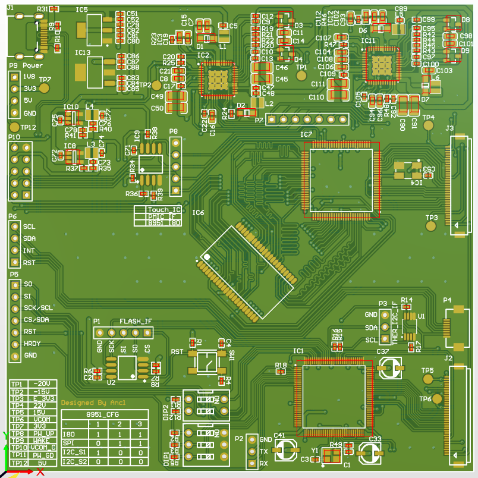
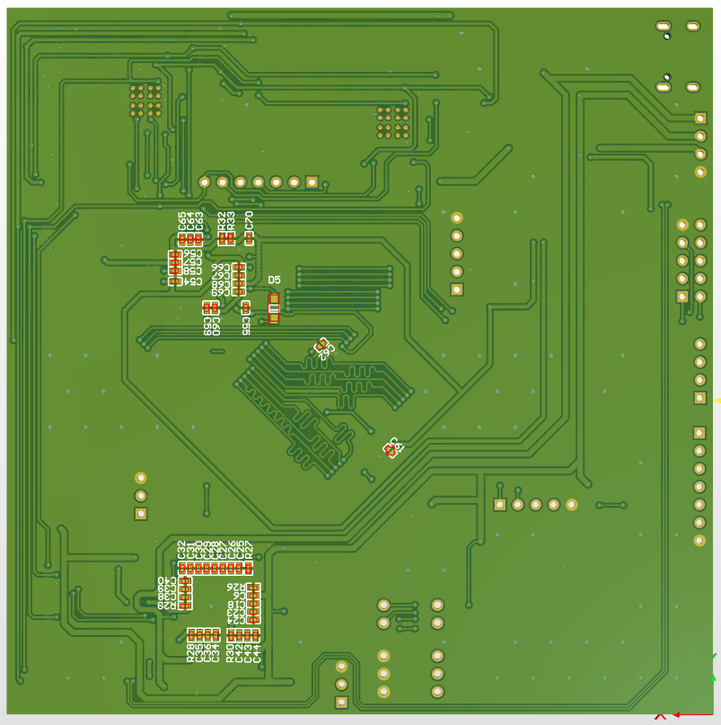
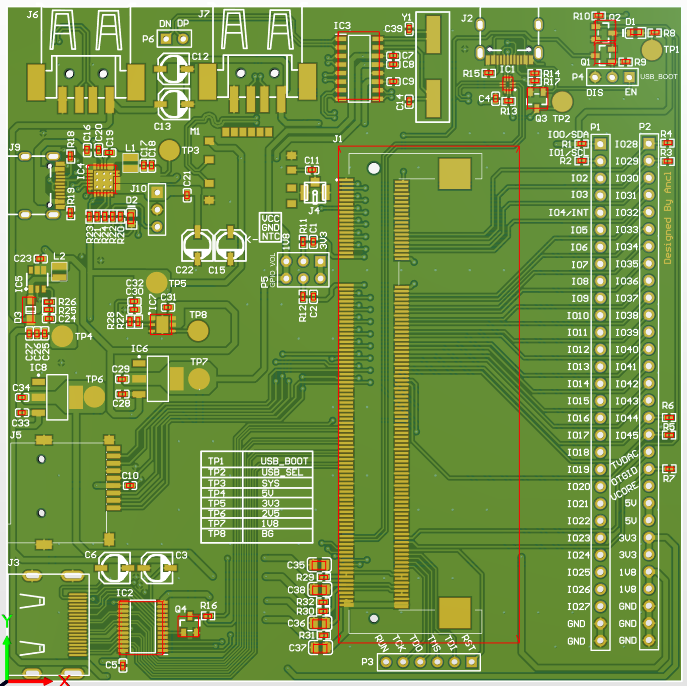
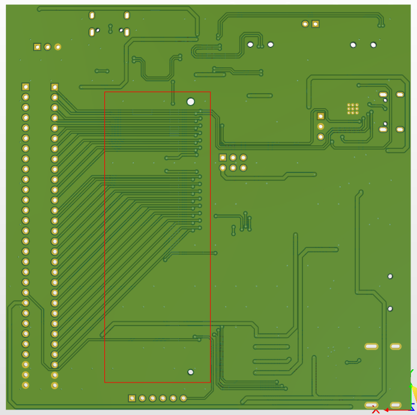

# 树莓派Eink阅读器
## 预览
### Driver board

---

### IO board

## 状态
- Drvier Board
   - 本次上传的为第二版，添加FPGA驱动回路，未经验证
- IO Board
   - 已验证，各功能可正常使用
   - 验证过程中有改正的地方，尚未反应至PCB文件中
- Software
   - 基于Qt，仅有一个基本的UI界面，书籍阅读功能依赖于Koreader

## 已知的问题
- Drvier Board
   - 第一版上的驱动芯片仅有IT8951以及TPS65186，无FPGA，在调试中发现了以下问题：
      - IT8951各通信接口无任何响应，推测此芯片可能需要下载固件
         - 作为代替方案，添加了FPGA驱动电路
      - TPS65186在驱动中发现其内部寄存器的默认值与数据手册描述不一致（甚至连芯片ID都对不上），咨询IT社区支持，其回应这是不可能的，除非芯片损坏或者是Fake芯片
         - 由于这个芯片是在tb买的，造假的可能性感觉更高一些(´_ゝ`)，因此添加了一款立创商城有的芯片
- IO Board
    - 电源芯片NTC反馈电阻阻值计算Miss
    - AMS1117的GND未与板子GND相连，导致无1.8V输出

## Reference
- [树莓派官方Extend Board设计资料](https://www.raspberrypi.org/documentation/hardware/computemodule/cm-emmc-flashing.md)
- [FPGA Eink Driver](https://hackaday.io/project/21168-fpga-eink-controller)
- [it8951 driver](https://github.com/julbouln/tinydrm_it8951)
- [koreader](https://github.com/koreader/koreader)